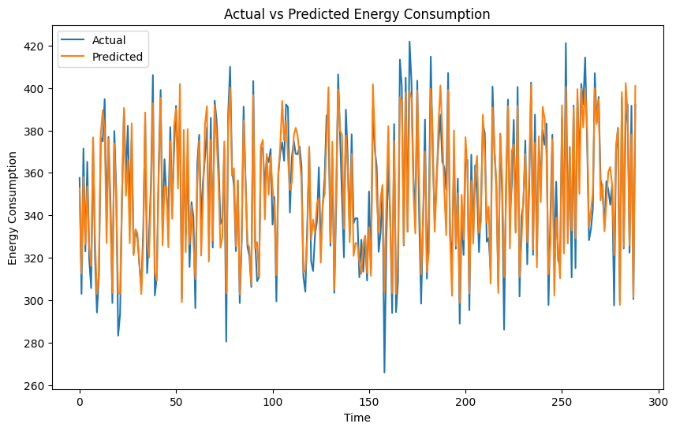

# Energy Consumption Analysis and Prediction using LSTM

## Overview
This project implements a Long Short-Term Memory (LSTM) neural network to analyze and predict energy consumption patterns. The model uses historical energy usage data to forecast future consumption levels, leveraging deep learning techniques for time series prediction. 


## Features
- Seasonal pattern recognition
- Time series analysis of energy consumption patterns
- Data preprocessing and normalization of energy metrics
- LSTM model implementation using PyTorch
- Energy consumption prediction
- Performance visualization and metrics
- Model evaluation with MSE and R-squared metrics
- Peak usage detection
- Tuning the Parameters
- Comparison between LSTM and BiLSTM

## Installation
1. Clone the repository:
```bash
git clone https://github.com/drisskhattabi6/Energy-Consumption-Analysis-and-Prediction.git
cd Energy-Consumption-Analysis-and-Prediction
```

## Model Architecture
The LSTM model consists of:
- Input layer (1 features: previous consumption)
- 3 LSTM layers with 150 hidden units
- Dropout layers (0.2) for regularization
- Fully connected output layer


## Results
- Mean Squared Error (MSE): 103.4072
- R-squared (R²) score: 0.9024
- Visualization of actual vs predicted consumption:

